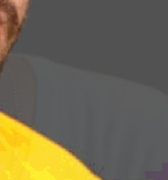

# Studies on Steganography

Studies on steganography algorithms and how robust they are when facing image compression. College assignment for **SCC0251 - Digital Image Processing @ ICMC - USP**.

<p align="left">
  
</p>

<hr>

|   Students |
| --- |


| [](https://github.com/felipecustodio) | [](https://github.com/carolesj) |
|:-----------------------------------------------------------------------------------------------------------------:|:-------------------------------------------------------------------------------------------------------:|
|                                [Felipe Custódio](https://github.com/felipecustodio)                                |                           [Caroline Jesuíno](https://github.com/carolesj)                           |


Table of Contents
=================

   * [Studies on Steganography](#studies-on-steganography)
      * [LSB Steganography](#lsb-steganography)
      * [Merging](#merging)
      * [Unmerging](#unmerging)
      * [Animation](#animation)
      * [Complex images](#complex-images)

<hr>


## LSB Steganography

The code for this demo is here: [demo.py](https://github.com/felipecustodio/steganography/blob/master/demo.py)

Meet **Choque de Cultura** members Rogerinho and Renan.


Rogerinho           |  Renan
:-------------------------:|:-------------------------:
  |  


Rogerinho is going to visit Renan's son. Let's make a surprise for Renan's son, the little warrior, the pumpkin soup.
Let's try to hide Renan into Rogerinho.
We'll need **imageio** for reading the image files, **numpy** for dealing with matrices and copies.


```python
import numpy as np
import imageio
import matplotlib.pyplot as plt
```

Read the files as RBG images.


```python
original = np.asarray(imageio.imread("images/rogerinho.png", as_gray=False, pilmode="RGB"))
secret = np.asarray(imageio.imread("images/renan.png", as_gray=False, pilmode="RGB"))
```

Since we want to merge 'secret' into 'original', we create a copy of 'original' that we'll perform the operations on. Numpy will make that easy for us.


```python
merged = np.copy(original)
```

The algorithm we implemented in this demonstration is *LSB Steganography*, meaning we'll hide the **most significant bits** of the secret image into the **least significant bits** of the original image, meaning the visual impact on the original image will be small.


Each pixel in the **RGB color model** consists of 3 values (Red, Green, Blue) with range 0-255, meaning each pixel is a tuple of **8-bit binary digits**.


For this demo, we used **4 bits** of each image. If the visual impact on the final image is too big, we can increase the number of bits we use from the original image while decreasing the number of bits we use from the secret image. This will result in less quality for the extracted image.


The final pixel will look like this:


|  Most Significant Bits   |  Least Significant Bits   |
| --- | --- |
|   Most significant bits from ORIGINAL  |  Most significant bits from SECRET   |


## Merging

Since we have to alter each pixel individually, let's use for loops. Numpy arrays have a [shape property](https://docs.scipy.org/doc/numpy/reference/generated/numpy.ndarray.shape.html) that can be easily accessed to get the pixel matrix size.


```python
for i in range(original.shape[0]):
    for j in range(original.shape[1]):
```


We can obtain the R, G, B values for a single pixel and convert them to binary strings.


```python
r, g, b = original[i][j]
# {0:08b} = 8 bit binary, fill with zeros
rgb1 = ('{0:08b}'.format(r), '{0:08b}'.format(g), '{0:08b}'.format(b))

r, g, b = secret[i][j]
rgb2 = ('{0:08b}'.format(r), '{0:08b}'.format(g), '{0:08b}'.format(b))

# merge into a single string
r1, g1, b1 = rgb1 # original rgb
r2, g2, b2 = rgb2 # secret rgb
```


Let's add the **most significant bits** of each image, forming the new pixel as stated above.


```python
rgb = (r1[:4] + r2[:4], g1[:4] + g2[:4], b1[:4] + b2[:4])

# convert back to int tuple
r, g, b = rgb
merged[i][j] = [int(r, 2), int(g, 2), int(b, 2)]
```

And that's it! Let's check out the result.


We can use RMSE to compare the merged image with the original.


**RMSE** = 10.8805


Despite the error looking *small*, we can see the flaws of this technique. In areas with a lot of color, we can see that there's visual impact, but it just looks like compression.


Looks like we could get away with that!


The problem arises in areas with few colors or details. You can almost see the secret image, because the most significant bits of the original image will not lessen the impact of the hidden image.





This means this technique is probably useful when hiding simple images on very complex images, like photos of forests or cities.

Let's try that later! Now, let's **extract** the hidden image.


## Unmerging


All we have to do is the inverse process.


You need to know how many bits were used to hide the image, and how they are distributed. Since we know how many bits were used and that they are the least significant ones, let's extract and check out how the hidden image looks like.


Can we still identify what it is? If the answer is yes, although we may lose quality, it's mission accomplished..


```python
for i in range(merged.shape[0]):
    for j in range(merged.shape[1]):
        # get RGB
        r, g, b = merged[i][j]
        r, g, b = ('{0:08b}'.format(r), '{0:08b}'.format(g), '{0:08b}'.format(b))
        # extract and concatenate with 0
        rgb = (r[4:] + "0000", g[4:] + "0000", b[4:] + "0000")
        # convert it back to int tuple
        r, g, b = rgb
        unmerged[i][j] = [int(r, 2), int(g, 2), int(b, 2)]
```


The extracted image looks like this:


**RMSE** = 15.6412


There's Renan! We can see the image lost some visual quality, but the results are impressive for such a simple technique. Also, the RMSE is bigger than the one for the merged image, meaning it's not always a good metric for visual impact. Although more pixels were affected here, we can **see** the hidden image in the merged one.


## Animation


Let's see the process in action:


Merge           |  Extract
:-------------------------:|:-------------------------:
  |  


## Complex images


Remember when we speculated that complex images would probably be less affected visually, so the results would be better? Here's another example: let's hide a dog in a forest.


Original           |  Secret
:-------------------------:|:-------------------------:
  |  


Merge           |  Extract
:-------------------------:|:-------------------------:
  |  


| Merged image |
| ------------ |


**RMSE** = 11.7578


This is a **much better** result. We can't see any recognizable signs of the dog and the visual impact is noticeable, but a lot less than the Rogerinho image. The more diverse the information in the high bits of the original image, the more we can hide images without getting caught visually.


| Extracted image |
| ------------ |


Again, the visual quality drop was expected, but we can still identify the dog and appreciate its cuteness.


**RMSE** = 14.5167
